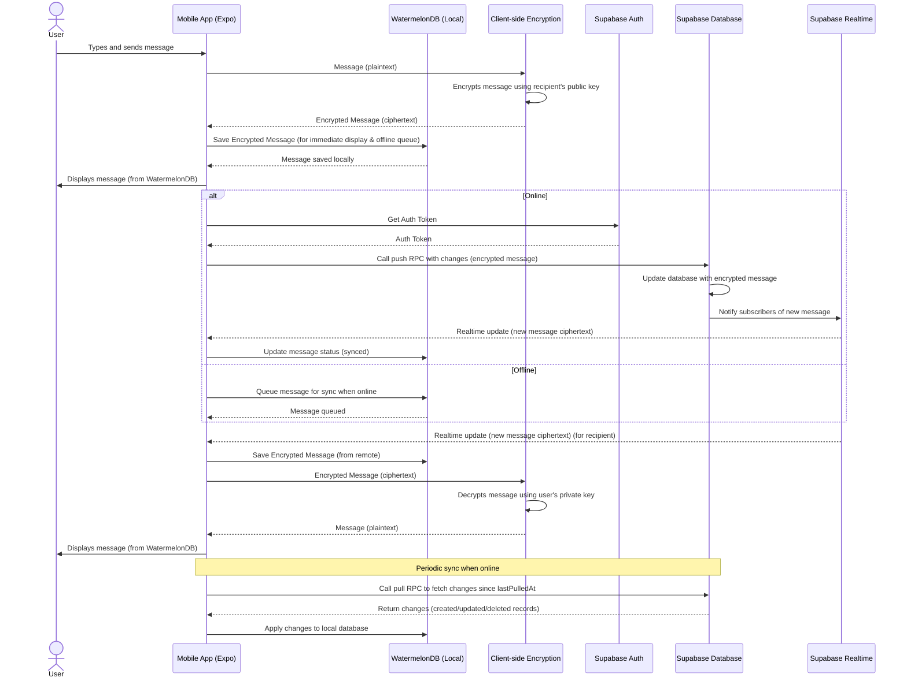

## Architectural Plan for Matur Chat App (Offline-First with WatermelonDB and Supabase)

### 1. Research and Comparison

To meet the requirements of 500 users, a smooth user experience, maximizing free-tier Supabase usage, and ensuring easy migration, the following technologies are recommended, updated to emphasize the offline-first approach:

*   **Realtime Database & Authentication:** Supabase remains the ideal choice for its PostgreSQL-based real-time database, Realtime Engine, and built-in authentication. Its free tier supports the initial scale of 500 users, and its integration with WatermelonDB enables robust offline-first capabilities.

*   **Mobile App Development:** Expo for React Native ensures rapid cross-platform development for iOS and Android. It integrates seamlessly with WatermelonDB for local storage and Supabase for backend synchronization, aligning with the offline-first paradigm.

*   **Video Call & Call:**
    *   **WebRTC:** Used for real-time communication. For free usage, self-hosted STUN/TURN servers or free-tier services are considered.
    *   **Options for Free Use:**
        *   **PeerJS/SimplePeer:** Simplifies WebRTC for peer-to-peer calls, with Supabase Realtime used for signaling. Offline-first considerations ensure call metadata (e.g., call history) is stored locally and synced when online.
        *   **Daily.co:** Offers a free tier with up to 20,000 meeting minutes/month, suitable for initial scale. Call metadata can be cached locally for offline access.
        *   **Jitsi Meet:** Open-source and self-hostable, offering full control for video calls. Local storage ensures call logs are available offline.
    *   **Recommendation:** Use PeerJS/SimplePeer for personal chats, leveraging Supabase Realtime for signaling. For group calls, use Daily.co’s free tier or self-host Jitsi. Store call metadata in WatermelonDB for offline access and sync with Supabase when online.

*   **File Storage:**
    *   **Supabase Storage:** Integrated with Supabase’s free tier, ideal for storing encrypted media files (e.g., images, videos). WatermelonDB stores metadata locally for offline access, with synchronization to Supabase Storage.
    *   **Cloudinary:** A fallback for advanced media handling if Supabase Storage limits are reached, with a free tier for transformations and delivery.
    *   **Recommendation:** Use Supabase Storage for unified integration with authentication and database. Store media metadata in WatermelonDB for offline access and queue uploads for when connectivity is restored.

*   **Deep Linking:** Branch.io’s free tier supports deep linking needs, with local caching of deep link data in WatermelonDB for offline handling.

*   **Analytics:** Firebase Analytics provides free, comprehensive tracking of user journeys. Analytics events can be queued locally in WatermelonDB during offline periods and synced when online.

*   **E2E Encryption:**
    *   **Signal Protocol:** Industry-standard for secure messaging but complex to implement.
    *   **Libsodium/TweetNaCl.js:** Lightweight cryptographic libraries for client-side E2E encryption. Messages and media are encrypted before storage in WatermelonDB or Supabase, ensuring end-to-end security.
    *   **Recommendation:** Use `libsodium-wrappers` or `tweetnacl-js` for client-side encryption. Store encrypted messages and media in WatermelonDB locally and sync encrypted blobs to Supabase, ensuring decryption only occurs on client devices.

*   **Offline-First Storage:** WatermelonDB, built on SQLite, provides a high-performance local database for React Native. It supports offline-first data storage and synchronization with Supabase via Remote Procedure Calls (RPCs), using a last-write-wins strategy for conflict resolution.

### 2. Select Optimal Architecture

The architecture is a **Client-Server with Realtime and Offline-First Capabilities**, using Supabase as the backend-as-a-service (BaaS), Expo/React Native for the mobile client, and WatermelonDB for local storage and synchronization.

*   **Justification:**
    *   **Performance & Scalability:** Supabase’s PostgreSQL and Realtime Engine handle database operations and real-time updates efficiently for 500 users within the free tier. WatermelonDB ensures instant local data access, reducing latency and enhancing UX even when offline.
    *   **Realtime:** Supabase Realtime enables instant message delivery and presence updates, with WatermelonDB caching data locally for seamless offline operation.
    *   **Offline-First:** WatermelonDB stores messages, user profiles, and metadata locally, allowing the app to function fully offline. Synchronization with Supabase occurs in the background when connectivity is restored, using a last-write-wins conflict resolution strategy.
    *   **Cost-Effectiveness:** Leverages Supabase’s free tier for database, authentication, storage, and real-time features. WatermelonDB is open-source, adding no cost. Free-tier video call solutions (e.g., PeerJS, Daily.co) further optimize costs.
    *   **Maintainability & Migration:** Supabase’s BaaS reduces backend management overhead. WatermelonDB’s modular sync logic and Supabase’s schema-driven approach allow for easier updates to the data model, though schema changes require updates to both WatermelonDB models and Supabase sync functions.

### 3. Modular Design

The application is structured into modules with clear responsibilities, updated to incorporate WatermelonDB for offline-first functionality:

*   **Client (Expo/React Native):**
    *   **UI Components:** Reusable elements (e.g., chat bubbles, user cards) that render data from WatermelonDB for instant display.
    *   **Feature Modules:** Encapsulate logic/UI for Authentication, Personal Chat, Community Chat, Calls, Search, etc., interacting with WatermelonDB for offline data access.
    *   **Data Layer:** Interfaces with Supabase client libraries for authentication, database queries, real-time subscriptions, and storage, with fallback to WatermelonDB when offline.
    *   **Local Persistence Layer (WatermelonDB):** Uses WatermelonDB to store messages, user profiles, contacts, and call metadata in a local SQLite database. Models are defined for each entity (e.g., `Message`, `Profile`, `Community`).
    *   **Synchronization Manager:** Implements WatermelonDB’s `synchronize` function to push local changes to Supabase and pull remote changes via Supabase RPCs (`push` and `pull` functions). Handles conflict resolution using last-write-wins.
    *   **Encryption Module:** Encrypts/decrypts messages and media client-side using `libsodium-wrappers` or `tweetnacl-js`. Stores encrypted data in WatermelonDB and Supabase.
    *   **Call Module:** Integrates WebRTC (via PeerJS/SimplePeer or Daily.co) for calls, storing call metadata in WatermelonDB for offline access.
    *   **Deep Linking Module:** Integrates Branch.io SDK, caching deep link data in WatermelonDB for offline processing.
    *   **Analytics Module:** Queues Firebase Analytics events in WatermelonDB during offline periods, syncing when online.

*   **Backend (Supabase):**
    *   **PostgreSQL Database:** Stores encrypted messages, user profiles, community data, and contact lists. Includes tables for sync metadata (e.g., `last_modified_at`, `deleted_at`).
    *   **Auth:** Manages user registration, login, and sessions, integrated with Supabase’s free-tier authentication.
    *   **Realtime:** Publishes database changes (e.g., new messages, presence updates) to subscribed clients, triggering WatermelonDB sync on other devices.
    *   **Storage:** Stores encrypted media files, with metadata cached in WatermelonDB for offline access.
    *   **Edge Functions (Optional):** Implements `push` and `pull` RPCs for WatermelonDB synchronization, staying within free-tier limits.

### 4. Comprehensive Use Case List

The use cases are updated to reflect offline-first capabilities:

*   **Authentication:**
    *   User Registration (Happy Path, Existing User, Invalid Credentials, Offline Queue for Sync)
    *   User Login (Happy Path, Invalid Credentials, Account Locked, Offline Cached Session)
    *   Password Reset (Happy Path, Invalid Email, Offline Queue)
    *   Session Management (Auto-login, Logout, Session Expiry, Offline Session Persistence)

*   **Personal Chat:**
    *   Send Text Message (Happy Path, Long Message, Empty Message, Offline Queue for Sync)
    *   Send Media Message (Image, Video, Audio - Happy Path, Large File, Unsupported Format, Offline Queue)
    *   Receive Message (Realtime, Offline Sync via WatermelonDB)
    *   View Chat History (Load from WatermelonDB, Sync New Messages, Empty History)
    *   Delete Message (Self, All, Local Delete with Sync)
    *   Typing Indicator (Realtime, Offline Cached)
    *   Read Receipts (Sent, Delivered, Read, Offline Queued)

*   **Community Chat:**
    *   Join Community (Happy Path, Already Joined, Private Community, Offline Queue)
    *   Send Message (Same as Personal Chat, Offline Queue)
    *   Receive Message (Realtime, Offline Sync)
    *   View Community Members (Cached in WatermelonDB)
    *   Leave Community (Local Update, Sync when Online)
    *   Community Moderation (Admin actions, Offline Queue)

*   **Call & Video Call:**
    *   Initiate Personal Call (Happy Path, User Offline, User Busy, Log in WatermelonDB)
    *   Receive Personal Call (Accept, Decline, Missed, Cached in WatermelonDB)
    *   In-Call Actions (Mute/Unmute, Video On/Off, Speaker On/Off, End Call)
    *   Initiate Group Call (Happy Path, Add/Remove Participants, Log in WatermelonDB)
    *   Receive Group Call (Join, Decline, Cached in WatermelonDB)
    *   Community Call (Initiate, Join, Leave, Log in WatermelonDB)
    *   Call Quality Handling (Network fluctuations, Reconnection, Offline Logging)

*   **Contact Management:**
    *   Search Contact (Happy Path, No Results, Partial Match, Local Search in WatermelonDB)
    *   View Contact Profile (Cached in WatermelonDB)
    *   Block/Unblock Contact (Local Update, Sync when Online)

*   **Community Management:**
    *   Create Community (Happy Path, Duplicate Name, Invalid Details, Offline Queue)
    *   Edit Community Profile (Local Update, Sync when Online)
    *   Invite Users to Community (Offline Queue)

*   **User Story:**
    *   Create Story (Text, Image, Video - Happy Path, Large File, Offline Queue)
    *   View Stories (Cached in WatermelonDB, Sync Expiry)
    *   Delete Story (Local Delete, Sync when Online)

*   **Notifications:**
    *   Realtime Message Notification (In-app, Push Notification, Cached in WatermelonDB)
    *   Call Notification (Incoming Call, Cached in WatermelonDB)
    *   Community Activity Notification (Cached in WatermelonDB)

*   **Settings & Options:**
    *   Edit Profile (Name, Avatar, Local Update, Sync when Online)
    *   Privacy Settings (Local Storage, Sync when Online)
    *   Notification Preferences (Local Storage, Sync when Online)

### 5. Sequence Diagram (Updated: Sending a Personal Chat Message with E2E Encryption and Offline-First using WatermelonDB)

The sequence diagram is updated to reflect WatermelonDB’s role in offline-first storage and synchronization with Supabase.

### 6. Documentation

Comprehensive documentation ensures maintainability and supports future development, updated to include offline-first specifics:

*   **Architecture Diagrams:** Include diagrams showing WatermelonDB’s role in local storage, synchronization flow with Supabase, and E2E encryption workflows.
*   **Setup Guide:** Instructions for setting up the development environment, including:
    *   Installing WatermelonDB, Supabase JavaScript client, and expo-build-properties.
    *   Configuring WatermelonDB’s native dependencies (e.g., simdjson for iOS via expo-build-properties).
    *   Setting up Supabase project with database schema, RPCs (`push`, `pull`), and utility functions (`epoch_to_timestamp`, `timestamp_to_epoch`).
*   **Deployment Instructions:** Guide for deploying the Expo app to app stores and configuring Supabase for production, including WatermelonDB schema migrations.
*   **API Contract (Internal):** Document WatermelonDB models (e.g., `Message`, `Profile`, `Community`), Supabase table schemas, and RPC signatures for `push` and `pull`.
*   **Best Practices:**
    *   **Coding Standards:** Use TypeScript for type safety in WatermelonDB models and Supabase interactions.
    *   **Security:** Implement E2E encryption with `libsodium-wrappers` or `tweetnacl-js`. Store only encrypted data in WatermelonDB and Supabase.
    *   **Performance:** Optimize WatermelonDB queries for local reads and minimize sync payload size.
    *   **Testing:** Test offline scenarios, sync conflict resolution, and encryption/decryption.
*   **Context Management:**
    *   **State Management:** Use Zustand or React Context API for UI state, with WatermelonDB as the source of truth for persistent data.
    *   **Session Management:** Store Supabase session tokens securely in WatermelonDB for offline authentication.
    *   **Caching & Local Persistence:** WatermelonDB stores messages, profiles, contacts, and call metadata locally, ensuring full offline functionality.
    *   **Data Synchronization:** Implement WatermelonDB’s `synchronize` function with Supabase RPCs (`push`, `pull`). Use last-write-wins for conflict resolution, with timestamps managed via `epoch_to_timestamp` and `timestamp_to_epoch` functions.
    *   **Data Consistency:** Supabase Realtime triggers sync on other devices when changes occur. Locally, WatermelonDB ensures immediate data availability. Periodic `pull` syncs fetch remote changes when online.
    *   **Error Handling:** Handle errors for Supabase API calls, WatermelonDB sync failures, encryption/decryption issues, and offline queue management. Log errors to Firebase Analytics (queued in WatermelonDB when offline).

### 7. Implementation Details (New Section)

To align with the offline-first approach from the Supabase blog post, here are specific implementation details:

*   **WatermelonDB Setup:**
    *   Install dependencies: `npm install @nozbe/watermelondb @supabase/supabase-js expo-build-properties`.
    *   Configure native dependencies for iOS (simdjson) using expo-build-properties, as shown in the document.
    *   Define WatermelonDB models for key entities (e.g., `Message`, `Profile`, `Community`, `CallLog`) with fields like `id`, `created_at`, `updated_at`, `deleted_at`, and relations (e.g., `Profile` has_many `Messages`).

*   **Supabase Schema:**
    *   Create tables mirroring WatermelonDB models (e.g., `messages`, `profiles`, `communities`) with fields for sync metadata (`last_modified_at`, `deleted_at`).
    *   Implement `push` and `pull` RPCs in Supabase to handle synchronization, as shown in the document. Example:
        *   `push`: Processes created, updated, and deleted records from WatermelonDB, applying changes to the database.
        *   `pull`: Returns changes since `last_pulled_at`, including created, updated, and deleted records.
    *   Add utility functions (`epoch_to_timestamp`, `timestamp_to_epoch`) for timestamp conversion.

*   **Synchronization Logic:**
    *   Use WatermelonDB’s `synchronize` function to orchestrate push/pull operations with Supabase RPCs.
    *   Implement last-write-wins conflict resolution, where the latest `updated_at` timestamp determines the winning change.
    *   Queue local changes in WatermelonDB when offline, syncing automatically when connectivity is restored.

*   **E2E Encryption Integration:**
    *   Encrypt messages and media client-side before saving to WatermelonDB or pushing to Supabase.
    *   Store recipient public keys in WatermelonDB for offline encryption.
    *   Decrypt messages on receipt using the user’s private key, stored securely on the device.

*   **Realtime Sync Triggers:**
    *   Use Supabase Realtime to subscribe to database changes, triggering WatermelonDB sync on other devices when new data is pushed.

*   **Trade-offs and Considerations:**
    *   **Pros:** Instant local reads/writes, seamless offline UX, robust sync with Supabase, and strong E2E encryption.
    *   **Cons:** Schema changes require updates to both WatermelonDB models and Supabase sync functions, adding maintenance overhead. Last-write-wins may lead to data loss in complex conflict scenarios; consider custom conflict resolution for critical data (e.g., messages).

This updated architectural plan integrates the offline-first approach using WatermelonDB and Supabase, ensuring a seamless user experience for the Matur chat app while staying within cost constraints and supporting future scalability.