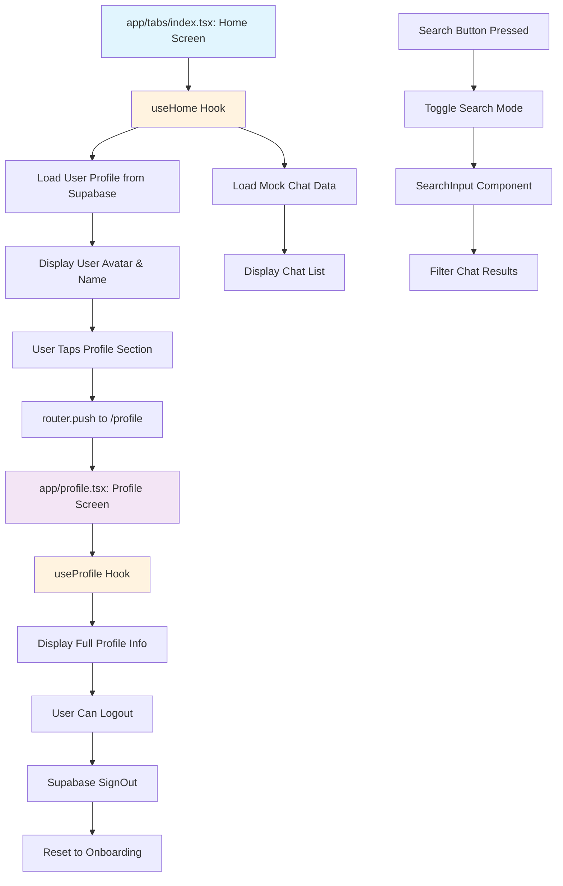

# Home Flow Documentation

## Overview

The Home Flow manages the main application interface where users can view their profile, search and browse chats, and navigate to their profile screen. This flow involves two main screens with supporting components for avatar display, search functionality, and user interaction.

## Flow Steps

### 1. Home Screen Entry Point (`app/(tabs)/index.tsx`)

The `HomeScreen` component serves as the primary interface for users after authentication. It provides:

**Key Features:**
- User profile display with avatar and name
- Chat list with search functionality  
- Toggle between normal and search modes
- Navigation to profile screen
- Loading states and empty state handling

**Core Implementation:**
- Uses the `useHome()` hook for all business logic
- Renders user avatar using the `Avatar` component
- Implements search with `SearchInput` component
- Displays chat items using `ChatListItem` component
- Handles profile navigation via `handleProfilePress()`

**Key Functions:**
```typescript
const {
  userProfile,        // Current user's profile data
  filteredChats,      // Filtered chat list based on search
  searchQuery,        // Current search input
  isSearchMode,       // Toggle state for search UI
  isLoading,          // Loading state for initial data fetch
  handleSearch,       // Search input handler
  toggleSearchMode,   // Switch between normal/search UI
  handleChatPress,    // Navigate to individual chat (TODO)
  handleProfilePress, // Navigate to profile screen
} = useHome();
```

**Navigation Flow:**
- Tapping the user section (avatar + name) triggers `router.push('/profile')`
- Search button toggles search mode UI
- Chat items are prepared for navigation (currently console log)

### 2. Profile Screen (`app/profile.tsx`)

The `ProfileScreen` displays detailed user information and provides logout functionality.

**Key Features:**
- Full-screen avatar display using `useAvatar()` hook
- User information display (name, phone, description)
- Last seen status with intelligent formatting
- Logout functionality with loading state
- Responsive scrollable layout

**Core Implementation:**
- Uses `useProfile()` hook for profile logic and logout
- Uses `useAvatar()` hook for avatar image handling
- Displays user profile data from global store
- Handles authentication logout with Supabase

**Key Functions:**
```typescript
const {
  userProfile,     // User profile data from store
  isLoading,       // Loading state for logout process
  handleLogout,    // Logout function with Supabase signOut
  formatLastSeen,  // Format last_seen_at into human-readable text
} = useProfile();
```

**Data Display:**
- **Avatar**: Full-width image display with error handling
- **Name**: Large title typography
- **Last Seen**: Formatted relative time display
- **Phone Number**: With fallback to "Not provided"  
- **Description**: With fallback to "No description"
- **Logout**: Red-colored logout button with loading indicator

## Supporting Components and Hooks

### `hooks/screens/useHome.ts`
- Manages home screen state and user interactions
- Fetches user profile from Supabase `profiles` table
- Loads mock chat data for demonstration
- Handles search filtering and chat participant matching
- Provides navigation functions

### `hooks/screens/useProfile.ts`  
- Manages profile screen functionality
- Handles Supabase authentication logout
- Formats last seen timestamps into readable format
- Manages loading states during logout process

### `src/components/Avatar/index.tsx`
- Reusable avatar component with multiple size options
- Handles image loading, error states, and fallbacks
- Shows user initials when image is unavailable
- Supports online status indicators
- Uses `useAvatar()` hook for image management

### `src/hooks/useAvatar.ts`
- Manages avatar image loading and caching
- Handles loading states and error conditions
- Provides optimized image URIs

## Flowchart



## Configurations and Dependencies

### Environment Variables
- Supabase configuration via `@/src/database/supabase`

### Key Dependencies
- `expo-router` - Navigation between screens
- `expo-image` - Optimized image loading for avatars
- `react-native-safe-area-context` - Safe area handling
- `@expo/vector-icons` - Icon components

### Global State Management
- `useUserStore()` - User profile and authentication state
- `useNavigationStore()` - Navigation state management

### Database Integration
- Supabase `profiles` table for user data
- Supabase Auth for authentication/logout

### Styling System
- Theme utilities: `colors`, `spacing`, `typography`, `fonts`
- Consistent styling across components

## Potential Issues and Troubleshooting

### Common Issues

1. **Avatar Loading Problems**
   - **Symptom**: Avatar shows initials instead of image
   - **Cause**: Network issues, invalid URLs, or CORS problems
   - **Solution**: Check `useAvatar()` hook error states and network connectivity

2. **Profile Data Missing**
   - **Symptom**: Empty profile fields or loading states persist
   - **Cause**: Supabase query failures or missing profile record
   - **Solution**: Verify user exists in `profiles` table and check Supabase connection

3. **Search Not Working**
   - **Symptom**: Search results don't update or show incorrect data
   - **Cause**: Mock data filtering logic issues
   - **Solution**: Check `filterChats()` function in `mockData.ts`

4. **Navigation Failures**
   - **Symptom**: Profile navigation doesn't work
   - **Cause**: Router configuration or file path issues
   - **Solution**: Verify `/profile` route exists and `expo-router` is configured

5. **Logout Issues**
   - **Symptom**: Logout button doesn't work or errors occur
   - **Cause**: Supabase connection problems or authentication state issues
   - **Solution**: Check Supabase configuration and network connectivity

### Performance Considerations

- Avatar component is memoized to prevent unnecessary re-renders
- Search filtering uses `useMemo()` for optimization
- Chat list implements proper `keyExtractor` for FlatList performance
- Image loading includes transition animations for smooth UX

### Development Notes

- Chat navigation is currently placeholder (`console.log`)
- Mock data is used for chat demonstration
- Profile data relies on Supabase `profiles` table structure
- Responsive design handles various screen sizes with safe areas