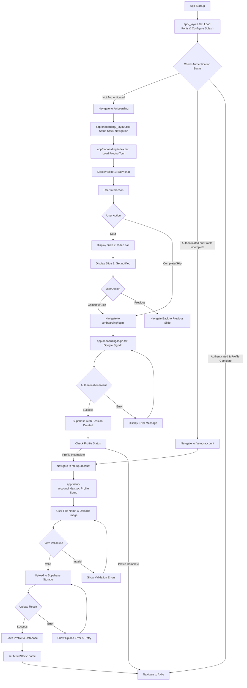

# Onboarding Flow Documentation

## Overview

The onboarding flow is a comprehensive user introduction and authentication system that guides new users through app features, Google authentication, and account setup. The flow is implemented using React Native, Expo Router, and Supabase for authentication, with Zustand for state management.

The flow consists of four main components:
1. **app/_layout.tsx** - Root application layout that handles routing and authentication logic
2. **app/onboarding/** - Onboarding route folder containing slides, login, and terms screens
3. **app/setup-account/** - Account setup flow for profile completion
4. **src/store/** - Zustand stores for navigation and user state management

### 3. app/setup-account/ - Account Setup Route Folder

**Role**: Handles user profile completion after successful authentication, including name input and profile image upload.

#### 3.1 app/setup-account/_layout.tsx - Setup Account Layout

**Role**: Configures the layout for account setup with a custom header that includes logout functionality.

**Key Functionality**:
- **Custom Header**: Uses `Header` component with logout functionality
- **State Management Integration**: Connects to Zustand stores for navigation and user state
- **Logout Handler**: Clears user state, resets navigation, and signs out from Supabase

**Code Example**:
```tsx
<Stack.Screen
  name="index"
  options={{
    headerShown: true,
    header: () => <Header onPress={() => {
      resetToOnboarding();
      supabase.auth.signOut();
      clearUser();
    }}/>,
  }}
/>
```

**Dependencies**:
- `@/src/components/Header` - Custom header component
- `@/src/store/navigationStore` - Navigation state management
- `@/src/store/userStore` - User state management
- `@/src/database/supabase` - Supabase client for authentication

#### 3.2 app/setup-account/index.tsx - Profile Setup Screen

**Role**: Comprehensive profile setup screen with image upload and name validation.

**Key Functionality**:
- **Image Upload**: Uses Expo ImagePicker with Supabase Storage integration
- **Form Validation**: Real-time name validation with error handling
- **File Processing**: Converts images to ArrayBuffer for Supabase upload
- **Error Recovery**: Retry logic for failed uploads with platform-specific handling
- **State Management**: Integration with navigation store for flow control

**Image Upload Process**:
```tsx
// 1. Pick image using Expo ImagePicker
const result = await ImagePicker.launchImageLibraryAsync({
  mediaTypes: ['images'],
  allowsEditing: true,
  aspect: [1, 1],
  quality: 0.5,
});

// 2. Convert to ArrayBuffer via FileSystem
const base64 = await FileSystem.readAsStringAsync(imageUri, {
  encoding: FileSystem.EncodingType.Base64,
});
const arrayBuffer = decode(base64);

// 3. Upload to Supabase Storage
const { error } = await supabase.storage
  .from('avatars')
  .upload(filePath, arrayBuffer, {
    contentType: mimeType,
    upsert: true
  });
```

**Validation Logic**:
- Name must be at least 2 characters
- Profile image is required
- Real-time validation feedback

**Error Handling**:
- Network connectivity issues
- File reading/conversion errors
- Upload retry logic (3 attempts on iOS, 1 on Android)
- User-friendly error messages with developer details in debug mode

**Navigation Flow**:
- On successful profile creation: `setActiveStack('home')` via navigation store
- Integrates with Zustand store for seamless navigation state management

**Dependencies**:
- `expo-image-picker` - Image selection functionality
- `expo-file-system` - File system operations
- `base64-arraybuffer` - Base64 to ArrayBuffer conversion
- `expo-linear-gradient` - Gradient button styling
- `@/src/database/supabase` - Database and storage operations
- `@/src/store/navigationStore` - Navigation state management

### 4. src/store/ - State Management with Zustand

**Role**: Provides global state management for navigation flow and user data using Zustand.

#### 4.1 src/store/navigationStore.ts - Navigation State Management

**Role**: Manages the application's navigation state and flow control.

**Key Functionality**:
- **Navigation Stack Management**: Tracks current active stack (onboarding, setup_account, home)
- **Navigation State**: Manages navigation loading states
- **Flow Control**: Provides actions to control navigation flow

**Store Structure**:
```tsx
export type NavigationStack = 'onboarding' | 'setup_account' | 'home';

interface NavigationStore {
  activeStack: NavigationStack;
  isNavigating: boolean;
  setActiveStack: (stack: NavigationStack) => void;
  setNavigating: (state: boolean) => void;
  resetToOnboarding: () => void;
}
```

**Usage Examples**:
- Setup account completion: `setActiveStack('home')`
- Logout flow: `resetToOnboarding()`
- Loading states: `setNavigating(true/false)`

#### 4.2 src/store/userStore.ts - User State Management

**Role**: Comprehensive user state management including authentication, profile data, and chat functionality.

**Key Functionality**:
- **User Authentication**: Stores Supabase user object for auth state
- **Profile Management**: Separate storage for detailed user profile with extended fields
- **Chat Management**: Handles user chats, messages, and chat updates
- **Loading States**: Manages loading indicators for async operations
- **Data Persistence**: Maintains user state across app sessions

**Enhanced Store Structure**:
```tsx
interface UserStore {
  user: User | null;
  userProfile: UserProfile | null;
  chats: Chat[];
  isLoading: boolean;
  setUser: (user: User | null) => void;
  setUserProfile: (profile: UserProfile | null) => void;
  updateUserProfile: (updates: Partial<UserProfile>) => void;
  setChats: (chats: Chat[]) => void;
  addChat: (chat: Chat) => void;
  updateChat: (chatId: string, updates: Partial<Chat>) => void;
  setLoading: (loading: boolean) => void;
  clearUser: () => void;
}
```

**Profile Management**:
- **setUserProfile**: Sets complete user profile data
- **updateUserProfile**: Partial updates to profile fields
- **Profile Fields**: Extended data including name, avatar, phone, description, timestamps

**Chat Functionality**:
- **setChats**: Initialize user's chat list
- **addChat**: Add new chat to the top of the list
- **updateChat**: Update specific chat properties (unread count, last message, etc.)

**Integration Points**:
- Login screen: Sets user and fetches profile data
- Setup account: Creates and updates user profile
- Profile screen: Manages profile editing and updates
- Chat system: Handles chat state and message management
- Logout: Comprehensive state clearing including chats and profile

**Dependencies**:
- `zustand` - State management library
- `@supabase/supabase-js` - Supabase user types
- `../types` - Custom UserProfile, Chat, and ChatMessage interfaces

## Flow Steps

### 1. app/_layout.tsx - Root Application Layout

**Role**: Main entry point that sets up the entire app navigation structure, font loading, splash screen handling, and conditional routing based on authentication status.

**Key Functionality**:
- **Font Loading**: Loads custom Montserrat font family variants (Regular, Medium, SemiBold, Bold) plus SpaceMono
- **Splash Screen Management**: Configures and controls the app splash screen with fade animation (300ms duration)
- **Status Bar Configuration**: Sets status bar style to 'light' for consistent UI appearance
- **Enhanced Authentication Logic**: Real-time authentication state checking with Supabase session management
- **Profile Completion Checking**: Uses `hasCompletedProfile()` to determine user setup status
- **Dynamic Navigation**: Uses Zustand store with `Stack.Protected` guards to route based on `activeStack` state
- **Auth State Subscription**: Listens to authentication changes for real-time navigation updates

**Enhanced Authentication Setup**:
```tsx
// Zustand store integration for dynamic navigation
const { setUser, clearUser } = useUserStore();
const { activeStack, setActiveStack, resetToOnboarding } = useNavigationStore();
const setUserProfile = useUserStore(state => state.setUserProfile);

// Real-time auth state checking
const checkUser = async () => {
  try {
    const { data, error } = await supabase.auth.getSession();
    if (error) {
      resetToOnboarding();
      clearUser();
      return;
    }
    
    const isAuthenticated = !!data.session;
    if (isAuthenticated && data.session?.user) {
      const profileCompleted = await hasCompletedProfile(data.session.user.id);
      await fetchUserProfile(data.session.user.id);
      setUser(data.session.user);
      setActiveStack(profileCompleted ? 'home' : 'setup_account');
    } else {
      clearUser();
    }
  } catch (error) {
    resetToOnboarding();
    clearUser();
  }
};
```

**Dynamic Navigation Logic**:
- **activeStack = 'onboarding'**: New users or signed-out users go to onboarding flow
- **activeStack = 'setup_account'**: Authenticated users without completed profiles
- **activeStack = 'home'**: Authenticated users with completed profiles go to main app
- **Real-time Updates**: Auth state changes automatically update navigation via subscription

**Auth State Subscription**:
```tsx
supabase.auth.onAuthStateChange(async (event, session) => {
  const isAuthenticated = !!session;
  
  if (isAuthenticated && event === 'SIGNED_IN' && session?.user) {
    const profileCompleted = await hasCompletedProfile(session.user.id);
    await fetchUserProfile(session.user.id);
    setUser(session.user);
    setActiveStack(profileCompleted ? 'home' : 'setup_account');
  } else if (!isAuthenticated) {
    clearUser();
  }
});
```

**Dependencies**:
- `expo-font` for font loading
- `expo-router/Stack` for navigation structure
- `expo-splash-screen` for splash screen management
- `expo-status-bar` for status bar styling
- `@/src/database/supabase` - Supabase client and `hasCompletedProfile()` helper
- `@/src/store/userStore` - User and profile state management
- `@/src/store/navigationStore` - Navigation stack management
- `@/src/components/Header` - Custom header component

### 2. app/onboarding/ - Onboarding Route Folder

**Role**: Contains the onboarding-specific screens and layouts, handling the presentation of introduction slides and navigation logic.

#### 2.1 app/onboarding/_layout.tsx - Onboarding Layout

**Role**: Sets up the navigation structure within the onboarding flow.

**Key Functionality**:
- Creates a nested `Stack` navigator for onboarding screens
- Configures the main onboarding screen (`index`) with no header

**Code Example**:
```tsx
<Stack>
  <Stack.Screen name="index" options={{ headerShown: false }} />
</Stack>
```

#### 2.2 app/onboarding/index.tsx - Main Onboarding Screen

**Role**: The primary onboarding screen that orchestrates the entire user introduction experience using a ProductTour component.

**Key Functionality**:
- **Slide Configuration**: Defines 3 introduction slides with titles, descriptions, and illustrations
- **Navigation Handlers**: Implements `handleComplete` and `handleSkip` functions
- **ProductTour Integration**: Renders the ProductTour component with slide data and event handlers

**Slide Data Structure**:
```tsx
const slides: ProductTourSlide[] = [
  {
    id: 1,
    title: 'Easy chat with your friends',
    description: 'Sed ut perspiciatis unde omnis iste natus error sit voluptatem accusantium doloremque.',
    illustration: require('@/src/assets/images/onboarding/slide_one.png'),
  },
  // ... additional slides
];
```

**Navigation Logic**:
- **Complete**: `router.push('/onboarding/login')` - Takes user to Google login
- **Skip**: `router.push('/onboarding/login')` - Same behavior as complete

**Error Handling**:
- Console logging for debugging navigation events

**Dependencies**:
- `@/src/components/ProductTour` - Main presentation component
- `@/src/types` - TypeScript interfaces for slide data
- `expo-router` - Navigation management

#### 2.3 app/onboarding/login.tsx - Google Authentication Screen

**Role**: Handles Google OAuth authentication using Supabase and Google Sign-In integration.

**Key Functionality**:
- **Google Sign-In Configuration**: Configures Google OAuth with web and iOS client IDs
- **Supabase Integration**: Uses Supabase auth to handle Google ID token authentication
- **Error Handling**: Comprehensive error handling for different Google Sign-In failure scenarios
- **Loading States**: Shows loading indicators and disables button during authentication

**Authentication Flow**:
```tsx
const handleGoogleSignIn = async () => {
  // 1. Check Google Play Services availability
  await GoogleSignin.hasPlayServices();
  
  // 2. Get user info and ID token from Google
  const userInfo = await GoogleSignin.signIn();
  
  // 3. Sign in to Supabase using the ID token
  const { error } = await supabase.auth.signInWithIdToken({
    provider: 'google',
    token: userInfo.data.idToken,
  });
};
```

**Error Scenarios Handled**:
- `SIGN_IN_CANCELLED`: User cancelled the sign-in process
- `IN_PROGRESS`: Sign-in is already in progress
- `PLAY_SERVICES_NOT_AVAILABLE`: Google Play Services not available
- Generic authentication errors with user-friendly messages

**UI Components**:
- Google Sign-In button with Google icon SVG
- Terms and Conditions link to `/onboarding/terms`
- Loading indicator during authentication
- Error message display

**Dependencies**:
- `@react-native-google-signin/google-signin` - Google OAuth integration
- `@/src/database/supabase` - Supabase client for authentication
- `expo-image` - Image component for Google icon

#### 2.4 app/onboarding/terms.tsx - Terms and Conditions Screen

**Role**: Displays the app's Terms and Conditions in a scrollable format.

**Key Functionality**:
- **Scrollable Content**: Full terms text with sections for acceptance, privacy, user accounts, etc.
- **Styled Layout**: Consistent theming with the app's color scheme and typography
- **Legal Content**: Covers standard app terms including user content, prohibited conduct, intellectual property

**Sections Covered**:
1. Acceptance of Terms
2. Privacy Policy
3. User Accounts
4. User Content
5. Prohibited Conduct
6. Intellectual Property
7. Termination
8. Limitation of Liability
9. Changes to Terms
10. Contact Information

**Dependencies**:
- Standard React Native components (ScrollView, Text, View)
- App theme utilities from `@/src/utils/theme`

## Flowchart



## Configurations and Dependencies

### Required Dependencies

**Core Framework & Navigation**:
- **expo-font**: Font loading and management
- **expo-router**: File-based routing and navigation
- **expo-splash-screen**: Splash screen control
- **expo-status-bar**: Status bar styling
- **react-native-reanimated**: Animation support for transitions

**Authentication & Backend**:
- **@supabase/supabase-js**: Backend authentication, database, and storage
- **@react-native-google-signin/google-signin**: Google OAuth integration
- **react-native-mmkv**: Secure, encrypted storage for auth tokens

**State Management**:
- **zustand**: Global state management for navigation, user data, and chats

**Image & Media Handling**:
- **expo-image-picker**: Image selection functionality for profile photos
- **expo-file-system**: File system operations for image processing
- **base64-arraybuffer**: Base64 to ArrayBuffer conversion for uploads
- **expo-image**: Optimized image rendering and caching

**UI Components & Styling**:
- **expo-linear-gradient**: Gradient styling for buttons and backgrounds

**Development & Types**:
- **typescript**: Type safety and development experience

### Font Assets
- SpaceMono-Regular.ttf
- Montserrat-Regular.ttf
- Montserrat-Medium.ttf  
- Montserrat-SemiBold.ttf
- Montserrat-Bold.ttf

### Image Assets
- `@/src/assets/images/onboarding/slide_one.png`
- `@/src/assets/images/onboarding/slide_two.png`
- `@/src/assets/images/onboarding/slide_three.png`
- `@/src/assets/images/google-icon.svg` - Google sign-in button icon
- `@/src/assets/images/camera-icon.svg` - Profile image upload placeholder

### Environment Variables
- **EXPO_PUBLIC_SUPABASE_URL**: Supabase project URL
- **EXPO_PUBLIC_SUPABASE_ANON_KEY**: Supabase anonymous API key
- **EXPO_PUBLIC_MMKV_ENCRYPTION_KEY**: MMKV encryption key for secure token storage
- **GOOGLE_WEB_CLIENT_ID**: Google OAuth web client ID
- **GOOGLE_IOS_CLIENT_ID**: Google OAuth iOS client ID

**Required .env Setup**:
```env
EXPO_PUBLIC_SUPABASE_URL=your_supabase_url
EXPO_PUBLIC_SUPABASE_ANON_KEY=your_supabase_anon_key
EXPO_PUBLIC_MMKV_ENCRYPTION_KEY=your_32_character_encryption_key
```

### Supabase Configuration
- **Authentication**: Google OAuth provider setup with MMKV encrypted token storage
- **Storage Bucket**: 'avatars' bucket for profile images
- **Database Table**: 'profiles' table for user profile data with enhanced schema
- **Row Level Security**: Configured for user data protection
- **Token Management**: MMKV storage for large auth tokens with encryption
- **Profile Completion**: Helper function `hasCompletedProfile()` for setup flow control
- **Auto Refresh**: Automatic token refresh on app state changes

**MMKV Storage Configuration**:
```tsx
const authStorage = new MMKV({
  id: 'auth-storage',
  encryptionKey, // From EXPO_PUBLIC_MMKV_ENCRYPTION_KEY
});

export const supabase = createClient(supabaseUrl, supabaseKey, {
  auth: {
    storage: {
      getItem: (key: string) => authStorage.getString(key),
      setItem: (key: string, value: string) => authStorage.set(key, value),
      removeItem: (key: string) => authStorage.delete(key),
    },
    autoRefreshToken: true,
    persistSession: true,
    detectSessionInUrl: false,
  },
});
```

**Profile Completion Helper**:
```tsx
export const hasCompletedProfile = async (userId: string) => {
  const { data, error } = await supabase
    .from('profiles')
    .select('name')
    .eq('id', userId)
    .maybeSingle();
    
  return !!(data && data.name);
};
```

### TypeScript Interfaces

**Core Onboarding Types**:
- `ProductTourSlide`: Slide data structure for onboarding presentation
- `ProductTourProps`: Component props for ProductTour component
- `OnboardingButtonProps`: Button component props for navigation
- `PageIndicatorProps`: Page indicator component props

**User and Profile Types**:
- `UserProfile`: Extended user profile with name, avatar, phone, description, timestamps
- `User`: Supabase user type from @supabase/supabase-js for authentication

**Chat and Messaging Types**:
- `Chat`: Chat room structure with participants and metadata
- `ChatMessage`: Individual message structure with content and metadata
- `ChatParticipant`: Chat participant relationship data
- `ChatListItemProps`: Component props for chat list items

**Store Interface Types**:
- `UserStore`: Enhanced Zustand user store with profile and chat management
- `NavigationStore`: Zustand navigation store interface
- `NavigationStack`: Union type for navigation states ('onboarding' | 'setup_account' | 'home')

**Avatar and Cache Types**:
- `AvatarProps`: Avatar component configuration and display options
- `CacheMetadata`: Cache management for avatar images
- `AvatarLoadResult`: Avatar loading result with cache information
- `AvatarServiceConfig`: Avatar service configuration options

**Component Props**:
- `SearchInputProps`: Search input component interface
- `BadgeProps`: Badge component for unread counts and notifications

## Potential Issues and Troubleshooting

### Common Issues

1. **Font Loading Failures**
   - **Problem**: Fonts don't load, causing text rendering issues
   - **Solution**: Verify font file paths in `app/_layout.tsx` and ensure font files exist in `assets/fonts/`
   - **Debug**: Check `loaded` state before rendering components

2. **Image Asset Loading**
   - **Problem**: Onboarding slide images don't display
   - **Solution**: Verify image paths match actual file locations and use `require()` syntax
   - **Debug**: Check console for asset loading errors

3. **Google Authentication Issues**
   - **Problem**: Google Sign-In fails or shows errors
   - **Solution**: Verify Google OAuth client IDs in `app/onboarding/login.tsx` and Google Console setup
   - **Debug**: Check Google Play Services availability and network connectivity
   - **Common Errors**: 
     - `SIGN_IN_CANCELLED`: User cancelled - normal behavior
     - `PLAY_SERVICES_NOT_AVAILABLE`: Update Google Play Services
     - `IN_PROGRESS`: Sign-in already running - wait or restart app

4. **Supabase Connection Issues**
   - **Problem**: Authentication or database operations fail
   - **Solution**: Verify environment variables (SUPABASE_URL, SUPABASE_ANON_KEY, MMKV_ENCRYPTION_KEY) are set correctly
   - **Debug**: Check network connectivity and Supabase project status
   - **Check**: Ensure Google provider is enabled in Supabase Auth settings
   - **MMKV Issues**: Verify encryption key is exactly 32 characters, check MMKV permissions
   - **Token Storage**: Clear MMKV storage if experiencing auth persistence issues

5. **Image Upload Failures**
   - **Problem**: Profile image upload fails in setup-account screen
   - **Solution**: Check Supabase Storage bucket 'avatars' exists and has proper RLS policies
   - **Debug**: Monitor retry attempts (3 on iOS, 1 on Android) and check file conversion
   - **Common Issues**:
     - Network timeouts: Implement exponential backoff
     - File format issues: Ensure supported image formats (jpg, png, gif, webp)
     - Storage permissions: Verify RLS policies allow authenticated uploads

6. **Navigation State Issues**
   - **Problem**: Navigation flow gets stuck or doesn't update properly
   - **Solution**: Check Zustand store state updates and verify navigation logic
   - **Debug**: Use React DevTools to monitor store state changes
   - **Reset**: Use `resetToOnboarding()` for error recovery
   - **Profile Completion**: Verify `hasCompletedProfile()` returns correct boolean
   - **Auth State Sync**: Ensure auth state changes trigger proper navigation updates

7. **TypeScript Errors**
   - **Problem**: Type mismatches in stores or component props
   - **Solution**: Verify interface definitions match implementation
   - **Debug**: Check import paths for type definitions and Zustand store types
   - **New Types**: Ensure UserProfile, Chat, and ChatMessage interfaces are properly imported
   - **Store Types**: Verify enhanced UserStore interface matches implementation

8. **Profile Completion and Store Issues**
   - **Problem**: User gets stuck in setup-account flow despite completing profile
   - **Solution**: Verify `hasCompletedProfile()` checks the correct fields and database table
   - **Debug**: Check profile data in Supabase dashboard, ensure name field is populated
   - **Store Sync**: Ensure `setUserProfile()` is called after profile creation
   - **Navigation**: Verify `setActiveStack('home')` is called after successful profile completion

9. **MMKV Storage and Token Issues**
   - **Problem**: Authentication state not persisting across app restarts
   - **Solution**: Verify MMKV encryption key is set and consistent across sessions
   - **Debug**: Check MMKV storage permissions and encryption key length (must be 32 characters)
   - **Token Corruption**: Clear MMKV storage if experiencing persistent auth issues
   - **Background Sync**: Ensure `AppState` listener is working for token refresh

10. **Platform-Specific Issues**
   - **Problem**: iOS crashes during image picker (iPhone 15 Pro + Face ID)
   - **Solution**: Use `UIImagePickerPresentationStyle.AUTOMATIC` in ImagePicker config
   - **Problem**: Android Google Sign-In issues
   - **Solution**: Verify SHA-1 certificate fingerprint in Google Console

### Best Practices

**Authentication & Security**:
- Always handle font loading states before rendering UI
- Use `router.replace()` instead of `router.push()` for onboarding completion to prevent back navigation
- Handle authentication state changes gracefully with proper cleanup in useEffect hooks
- Secure MMKV encryption keys and never commit them to version control
- Implement proper auth state subscription cleanup to prevent memory leaks

**State Management**:
- Use Zustand stores for navigation state management instead of local component state
- Separate user authentication (`user`) from profile data (`userProfile`) in stores
- Clear all user-related state comprehensively on logout (user, profile, chats)
- Use proper TypeScript types for all store interactions

**Error Handling & UX**:
- Implement proper error boundaries for asset loading failures
- Implement retry logic for network operations (especially image uploads)
- Validate user input in real-time for better UX
- Use proper loading states during async operations
- Implement comprehensive error handling with user-friendly messages
- Follow platform-specific guidelines for image picker configuration

**Profile & Chat Management**:
- Verify profile completion with `hasCompletedProfile()` before navigation
- Use `setUserProfile()` after successful profile creation
- Handle chat state updates efficiently to prevent unnecessary re-renders
- Implement proper avatar caching for better performance

### Future Enhancements
- Add social login options beyond Google (Apple, Facebook, Twitter)
- Implement onboarding skip preferences with local storage
- Add user profile edit functionality after initial setup
- Implement advanced image editing features (cropping, filters)
- Add profile completion progress indicators
- Implement analytics tracking for onboarding completion rates
- Add email verification flow as backup authentication method
- Implement offline-first profile caching
- Add profile data backup and restore functionality
- Implement advanced error recovery with automatic retry strategies
- Add accessibility improvements for screen readers
- Implement deep linking for authentication callbacks
- Add multi-language support for terms and conditions

Documentation created/updated. Anything else?