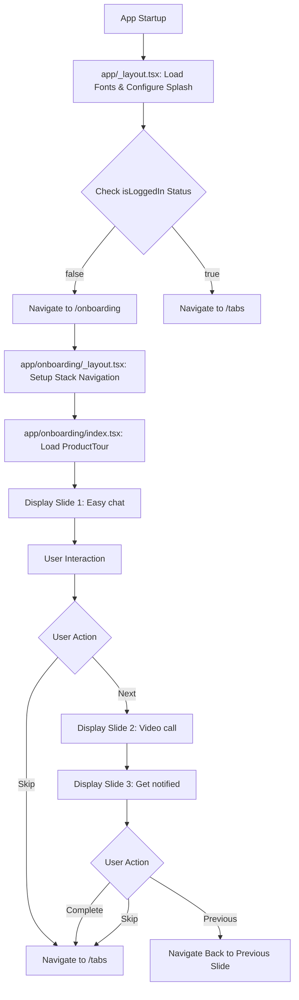

# Onboarding Flow Documentation

## Overview

The onboarding flow is a user introduction system that guides new users through the app's key features using a multi-slide presentation. The flow is implemented using React Native and Expo Router, starting from the main app layout and routing to a dedicated onboarding screen with interactive slides.

The flow consists of two main components:
1. **app/_layout.tsx** - Root application layout that handles routing and authentication logic
2. **app/onboarding/** - Onboarding route folder containing the onboarding screens and navigation

## Flow Steps

### 1. app/_layout.tsx - Root Application Layout

**Role**: Main entry point that sets up the entire app navigation structure, font loading, splash screen handling, and conditional routing based on authentication status.

**Key Functionality**:
- **Font Loading**: Loads custom Montserrat font family variants (Regular, Medium, SemiBold, Bold) plus SpaceMono
- **Splash Screen Management**: Configures and controls the app splash screen with fade animation (300ms duration)
- **Status Bar Configuration**: Sets status bar style to 'light' for consistent UI appearance
- **Conditional Navigation**: Uses `Stack.Protected` guards to route users based on `isLoggedIn` status

**Code Example**:
```tsx
const [loaded] = useFonts({
  SpaceMono: require('../assets/fonts/SpaceMono-Regular.ttf'),
  'Montserrat-Regular': require('../assets/fonts/Montserrat-Regular.ttf'),
  'Montserrat-Medium': require('../assets/fonts/Montserrat-Medium.ttf'),
  'Montserrat-SemiBold': require('../assets/fonts/Montserrat-SemiBold.ttf'),
  'Montserrat-Bold': require('../assets/fonts/Montserrat-Bold.ttf'),
});

const isLoggedIn = false;
```

**Authentication Logic**:
- When `isLoggedIn = true`: User is routed to `(tabs)` - the main app tabs
- When `isLoggedIn = false`: User is routed to `onboarding` - the onboarding flow

**Dependencies**:
- `expo-font` for font loading
- `expo-router/Stack` for navigation structure
- `expo-splash-screen` for splash screen management
- `expo-status-bar` for status bar styling

### 2. app/onboarding/ - Onboarding Route Folder

**Role**: Contains the onboarding-specific screens and layouts, handling the presentation of introduction slides and navigation logic.

#### 2.1 app/onboarding/_layout.tsx - Onboarding Layout

**Role**: Sets up the navigation structure within the onboarding flow.

**Key Functionality**:
- Creates a nested `Stack` navigator for onboarding screens
- Configures the main onboarding screen (`index`) with no header

**Code Example**:
```tsx
<Stack>
  <Stack.Screen name="index" options={{ headerShown: false }} />
</Stack>
```

#### 2.2 app/onboarding/index.tsx - Main Onboarding Screen

**Role**: The primary onboarding screen that orchestrates the entire user introduction experience using a ProductTour component.

**Key Functionality**:
- **Slide Configuration**: Defines 3 introduction slides with titles, descriptions, and illustrations
- **Navigation Handlers**: Implements `handleComplete` and `handleSkip` functions
- **ProductTour Integration**: Renders the ProductTour component with slide data and event handlers

**Slide Data Structure**:
```tsx
const slides: ProductTourSlide[] = [
  {
    id: 1,
    title: 'Easy chat with your friends',
    description: 'Sed ut perspiciatis unde omnis iste natus error sit voluptatem accusantium doloremque.',
    illustration: require('@/assets/images/onboarding/slide_one.png'),
  },
  // ... additional slides
];
```

**Navigation Logic**:
- **Complete**: `router.replace('/(tabs)')` - Takes user to main app
- **Skip**: `router.replace('/(tabs)')` - Same behavior as complete (future: should go to login)

**Error Handling**:
- Console logging for debugging navigation events
- Future implementation notes for login screen integration

**Dependencies**:
- `@/src/components/ProductTour` - Main presentation component
- `@/src/types` - TypeScript interfaces for slide data
- `expo-router` - Navigation management

## Flowchart



## Configurations and Dependencies

### Required Dependencies
- **expo-font**: Font loading and management
- **expo-router**: File-based routing and navigation
- **expo-splash-screen**: Splash screen control
- **expo-status-bar**: Status bar styling
- **react-native-reanimated**: Animation support

### Font Assets
- SpaceMono-Regular.ttf
- Montserrat-Regular.ttf
- Montserrat-Medium.ttf  
- Montserrat-SemiBold.ttf
- Montserrat-Bold.ttf

### Image Assets
- `@/assets/images/onboarding/slide_one.png`
- `@/assets/images/onboarding/slide_two.png`
- `@/assets/images/onboarding/slide_three.png`

### Environment Variables
None required for basic functionality.

### TypeScript Interfaces
- `ProductTourSlide`: Slide data structure
- `ProductTourProps`: Component props for ProductTour

## Potential Issues and Troubleshooting

### Common Issues

1. **Font Loading Failures**
   - **Problem**: Fonts don't load, causing text rendering issues
   - **Solution**: Verify font file paths in `app/_layout.tsx` and ensure font files exist in `assets/fonts/`
   - **Debug**: Check `loaded` state before rendering components

2. **Image Asset Loading**
   - **Problem**: Onboarding slide images don't display
   - **Solution**: Verify image paths in `app/onboarding/index.tsx` match actual file locations
   - **Debug**: Use `require()` syntax for local assets, not dynamic imports

3. **Navigation Issues**
   - **Problem**: Users get stuck in onboarding or routing fails
   - **Solution**: Check `isLoggedIn` logic in `app/_layout.tsx` and verify route names match file structure
   - **Debug**: Add console logs in navigation handlers

4. **Splash Screen Problems**
   - **Problem**: Splash screen doesn't hide or shows indefinitely
   - **Solution**: Ensure `SplashScreen.hide()` is called in `useEffect` when fonts are loaded
   - **Debug**: Check font loading state and `loaded` dependency array

5. **TypeScript Errors**
   - **Problem**: Type mismatches in slide data or component props
   - **Solution**: Verify `ProductTourSlide` interface matches slide object structure
   - **Debug**: Check import paths for type definitions from `@/src/types`

### Best Practices
- Always handle font loading states before rendering UI
- Use `router.replace()` instead of `router.push()` for onboarding completion to prevent back navigation
- Implement proper error boundaries for asset loading failures
- Consider adding loading states for better user experience

### Future Enhancements
- Replace hardcoded `isLoggedIn = false` with actual authentication logic
- Implement proper login screen routing instead of direct tab navigation
- Add user preferences to remember onboarding completion status
- Implement analytics tracking for onboarding completion rates

Documentation created/updated. Anything else?