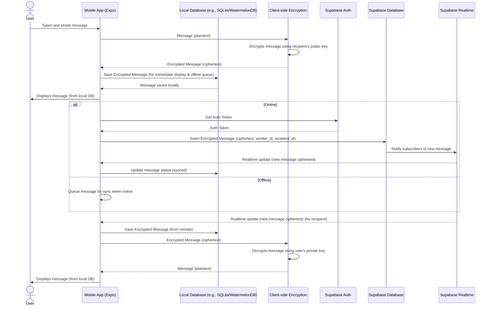

## Architectural Plan for Matur Chat App (Offline-First)

### 1. Research and Comparison

Given your constraints of 500 users, smooth user experience, maximizing free usage of Supabase, and easy migration for future improvements, the following technologies are recommended:

*   **Realtime Database & Authentication:** Supabase is an excellent choice as it provides real-time capabilities through PostgreSQL and its Realtime Engine, along with built-in authentication. Its generous free tier aligns with your budget constraints.

*   **Mobile App Development:** Expo for iOS and Android is suitable for rapid development and cross-platform compatibility. It integrates well with React Native, which is the foundation of your existing project structure.

*   **Video Call & Call:**
    *   **WebRTC:** This is the underlying technology for real-time communication. For free usage, you'll likely need to manage your own STUN/TURN servers or use a service with a free tier.
    *   **Options for Free Use:**
        *   **PeerJS/SimplePeer:** Libraries that abstract WebRTC complexities, allowing for direct peer-to-peer connections. You'd need to host a signaling server (e.g., using Node.js and WebSockets) which can be done on a free tier of a cloud provider.
        *   **Daily.co:** Offers a free tier for up to 20,000 meeting minutes per month, which might be sufficient for 500 users initially. It simplifies WebRTC integration significantly.
        *   **Jitsi Meet:** Open-source and self-hostable. While it requires more setup, it offers complete control and no direct cost for usage.
    *   **Recommendation:** Start with PeerJS/SimplePeer for direct peer-to-peer calls for personal chats, leveraging Supabase's real-time capabilities for signaling. For group calls, consider Daily.co's free tier or explore self-hosting Jitsi if usage exceeds Daily.co's limits.

*   **File Storage:**
    *   **Supabase Storage:** Supabase offers integrated object storage, which is convenient and has a free tier that should cover initial needs. It's tightly integrated with Supabase authentication and database.
    *   **Cloudinary:** Offers a generous free tier for image and video management, including transformations and delivery. Useful if you need more advanced media handling.
    *   **Recommendation:** Utilize Supabase Storage for general file storage (e.g., chat media, user avatars) to keep the stack unified and maximize free usage.

*   **Deep Linking:** Branch.io is a robust solution for deep linking and attribution. Its free tier is generally sufficient for basic deep linking needs.

*   **Analytics:** Firebase Analytics is a good choice for user journey tracking, offering a free and comprehensive suite of analytics tools.

*   **E2E Encryption:**
    *   **Signal Protocol:** The gold standard for E2E encryption in messaging apps. Implementing it directly is complex but provides strong security.
    *   **Libsodium/TweetNaCl.js:** Cryptographic libraries that can be used to implement E2E encryption. Messages would be encrypted on the client-side before being sent to Supabase, and decrypted on the client-side upon receipt. Supabase would store only encrypted blobs.
    *   **Recommendation:** Implement E2E encryption using a client-side cryptographic library like `libsodium-wrappers` or `tweetnacl-js`. This ensures that Supabase only handles encrypted data, and decryption happens only on the end-user devices. This is compatible with Supabase as Supabase acts as a secure transport and storage layer for encrypted data.

### 2. Select Optimal Architecture

The optimal architecture will be a **Client-Server with Realtime and Offline-First Capabilities**, leveraging Supabase as the backend-as-a-service (BaaS) and Expo/React Native for the mobile clients.

*   **Justification:**
    *   **Performance & Scalability:** Supabase handles database, authentication, and real-time subscriptions efficiently. For 500 users, its free tier and underlying PostgreSQL/Elixir (Realtime) are highly performant. Scaling beyond 500 users would involve upgrading Supabase plans, but the architecture remains largely the same.
    *   **Realtime:** Supabase Realtime provides instant updates for chat messages, presence, and notifications, crucial for a smooth user experience.
    *   **Offline-First:** By implementing a local database and synchronization mechanisms, the app remains functional even without an internet connection, providing a seamless user experience.
    *   **Cost-Effectiveness:** Maximizes free usage by leveraging Supabase's generous free tier for core services and exploring free/open-source options for video calls and E2E encryption.
    *   **Maintainability & Migration:** Using a BaaS like Supabase reduces operational overhead. The modular design and client-side encryption allow for easier migration of specific components (e.g., switching video call providers) without re-architecting the entire system.

### 3. Modular Design

The application will be structured into distinct modules with clear responsibilities:

*   **Client (Expo/React Native):**
    *   **UI Components:** Reusable UI elements (e.g., chat bubbles, user cards).
    *   **Feature Modules:** Encapsulate logic and UI for specific features (Login, Register, Personal Chat, Community Chat, Calls, Search, etc.).
    *   **Data Layer:** Handles interaction with Supabase client libraries (authentication, database queries, real-time subscriptions, storage uploads/downloads).
    *   **Local Persistence Layer:** Manages the local database for offline data storage and retrieval.
    *   **Synchronization Manager:** Orchestrates data synchronization between the local database and Supabase.
    *   **Encryption Module:** Manages E2E encryption/decryption of messages and media.
    *   **Call Module:** Integrates with WebRTC libraries/services for voice/video calls.
    *   **Deep Linking Module:** Handles incoming deep links using Branch.io SDK.
    *   **Analytics Module:** Integrates Firebase Analytics for tracking user events.

*   **Backend (Supabase):**
    *   **PostgreSQL Database:** Stores user data, chat messages (encrypted), community information, contact lists, etc.
    *   **Auth:** Handles user registration, login, and session management.
    *   **Realtime:** Publishes database changes and custom events to subscribed clients.
    *   **Storage:** Stores user-uploaded files (e.g., images, videos).
    *   **Edge Functions (Optional):** For custom backend logic, if needed, but try to minimize to stay within free tier limits.

### 4. Comprehensive Use Case List

Here's a detailed list of use cases:

*   **Authentication:**
    *   User Registration (Happy Path, Existing User, Invalid Credentials)
    *   User Login (Happy Path, Invalid Credentials, Account Locked)
    *   Password Reset (Happy Path, Invalid Email)
    *   Session Management (Auto-login, Logout, Session Expiry)

*   **Personal Chat:**
    *   Send Text Message (Happy Path, Long Message, Empty Message, Offline User)
    *   Send Media Message (Image, Video, Audio - Happy Path, Large File, Unsupported Format)
    *   Receive Message (Realtime, Offline Sync)
    *   View Chat History (Load More, Empty History)
    *   Delete Message (Self, All)
    *   Typing Indicator (Start, Stop)
    *   Read Receipts (Sent, Delivered, Read)

*   **Community Chat:**
    *   Join Community (Happy Path, Already Joined, Private Community)
    *   Send Message (Same as Personal Chat)
    *   Receive Message (Realtime)
    *   View Community Members
    *   Leave Community
    *   Community Moderation (Admin actions - if applicable)

*   **Call & Video Call:**
    *   Initiate Personal Call (Happy Path, User Offline, User Busy)
    *   Receive Personal Call (Accept, Decline, Missed)
    *   In-Call Actions (Mute/Unmute, Video On/Off, Speaker On/Off, End Call)
    *   Initiate Group Call (Happy Path, Add Participants, Remove Participants)
    *   Receive Group Call (Join, Decline)
    *   Community Call (Initiate, Join, Leave)
    *   Call Quality Handling (Network fluctuations, Reconnection)

*   **Contact Management:**
    *   Search Contact (Happy Path, No Results, Partial Match)
    *   View Contact Profile
    *   Block/Unblock Contact

*   **Community Management:**
    *   Create Community (Happy Path, Duplicate Name, Invalid Details)
    *   Edit Community Profile
    *   Invite Users to Community

*   **User Story:**
    *   Create Story (Text, Image, Video - Happy Path, Large File)
    *   View Stories (Next/Previous Story, Story Expiry)
    *   Delete Story

*   **Notifications:**
    *   Realtime Message Notification (In-app, Push Notification)
    *   Call Notification (Incoming Call)
    *   Community Activity Notification

*   **Settings & Options:**
    *   Edit Profile (Name, Avatar)
    *   Privacy Settings
    *   Notification Preferences

### 5. Sequence Diagram (Example: Sending a Personal Chat Message with E2E Encryption and Offline-First)

### 6. Documentation

Comprehensive documentation will be crucial for maintainability and future development:

*   **Architecture Diagrams:** High-level and detailed diagrams illustrating component interactions.
*   **Setup Guide:** Step-by-step instructions for setting up the development environment, including Supabase project setup, API keys, and local dependencies.
*   **Deployment Instructions:** Guide for deploying the Expo app to app stores and configuring Supabase for production.
*   **API Contract (Internal):** While not explicitly requested for external APIs, internal API contracts (e.g., database schema, Supabase function signatures) will be documented.
*   **Best Practices:** Guidelines for coding standards, security (especially E2E encryption implementation), performance optimization, and testing.
*   **Context Management:**
    *   **State Management:** Use a robust state management library (e.g., Zustand, React Context API) within the Expo app to manage UI state, user sessions, and real-time data.
    *   **Session Management:** Supabase handles session management for authentication. The client app will store session tokens securely.
    *   **Caching & Local Persistence:** Implement client-side caching for frequently accessed data and a local database (e.g., SQLite, WatermelonDB, Realm) for persistent storage of messages, contacts, and other critical data. This ensures data availability even when offline.
    *   **Data Synchronization:** Implement a synchronization manager that handles pushing local changes to Supabase when online and pulling remote changes to update the local database. This can involve techniques like last-write-wins or custom conflict resolution logic.
    *   **Data Consistency:** Leverage Supabase's real-time subscriptions to ensure data consistency across all connected clients. For offline scenarios, the local database acts as the source of truth until synchronization occurs.
    *   **Error Handling:** Define clear error handling mechanisms for API calls, real-time subscriptions, encryption/decryption failures, and synchronization conflicts.

This updated plan provides a robust foundation for building your Matur chat application, balancing features, performance, cost-effectiveness, and now, crucial **offline-first reliability** for a seamless user experience.
        